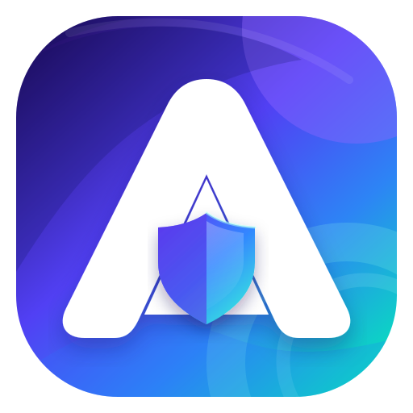
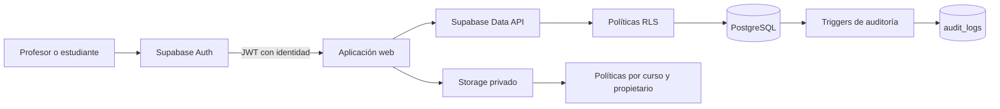
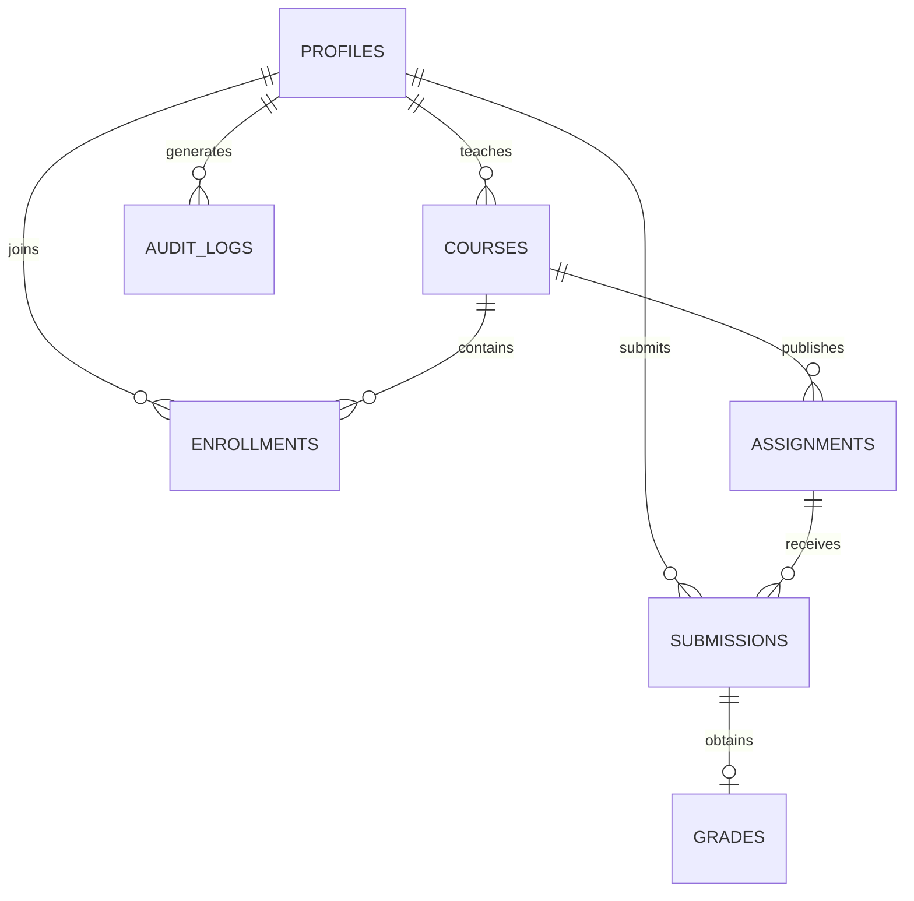

<div align="center">
  

  # AulaSegura

  **Portal académico privado con identidad, permisos por fila y archivos protegidos.**

  `Supabase Auth` · `PostgreSQL` · `Row Level Security` · `Supabase Storage` · `Auditoría`

  **[Abrir demo en producción](https://aulasegura-three.vercel.app)**
</div>

---

## El reto

**Identidad y datos seguros — dificultad media-alta.**

El objetivo es construir un producto con cuentas reales, al menos dos roles y políticas Row Level Security (RLS) que impidan consultar o modificar datos ajenos. Auth y Storage deben formar parte del producto y la demo debe incluir una prueba visible de acceso denegado.

## El problema

En muchos entornos educativos, cursos, tareas, entregas y calificaciones se comparten mediante herramientas que no controlan correctamente quién puede consultar o modificar cada dato. Ocultar botones en la interfaz no es suficiente: una petición directa a la API todavía podría exponer información de otros usuarios si la base de datos no aplica sus propios permisos.

## La solución

AulaSegura es un portal privado para colegios con dos experiencias diferenciadas:

- El **profesor** administra únicamente sus cursos, publica actividades, comparte materiales, revisa entregas y califica.
- El **estudiante** accede únicamente a los cursos donde está matriculado, consulta tareas publicadas, entrega archivos y revisa sus propias notas.

La autorización no depende de la interfaz. Cada consulta pasa por políticas RLS en PostgreSQL y cada archivo pasa por políticas de Storage. La aplicación incluye una consola que ejecuta pruebas reales para demostrar el bloqueo.

> **Prueba clave de la demo:** un usuario autenticado intenta consultar filas ajenas y Supabase devuelve cero resultados o rechaza la operación. El mismo principio protege perfiles, cursos, entregas, calificaciones y archivos.

## Funcionalidades

### Para profesores

- Registro e inicio de sesión con rol docente.
- Creación, archivo y reactivación de cursos.
- Código de invitación único por curso.
- Creación de tareas como borrador o publicación inmediata.
- Edición y cierre de actividades.
- Archivos de clase almacenados en un bucket privado.
- Seguimiento de matrículas, entregas y fechas próximas.
- Calificación sobre 10 con retroalimentación editable.
- Centro de notificaciones con entregas pendientes.

### Para estudiantes

- Registro e inicio de sesión con rol estudiante.
- Matrícula mediante código de invitación.
- Consulta de cursos y tareas publicadas.
- Búsqueda y filtros por estado de actividad.
- Descarga temporal de materiales autorizados.
- Entrega privada de archivos y comentarios.
- Consulta exclusiva de sus calificaciones.
- Centro de notificaciones con pendientes y notas recientes.

### Para la demostración de seguridad

- Consola accesible desde el indicador **RLS activa**.
- Verificación de sesión y token de Supabase Auth.
- Lectura permitida del perfil propio.
- Intento de lectura de filas ajenas.
- Intento de alterar un identificador protegido.
- Intento de descargar una ruta privada no autorizada.
- Registro de auditoría consultable, filtrable y exportable a JSON.
- Tema claro/oscuro y diseño responsive.

## Arquitectura de seguridad



### Capas implementadas

1. **Auth:** identifica al usuario mediante una sesión real.
2. **Roles:** `teacher` y `student` determinan las operaciones permitidas.
3. **RLS:** filtra cada fila en perfiles, cursos, matrículas, tareas, entregas, notas y auditoría.
4. **Storage:** el bucket `course-files` es privado y entrega enlaces firmados de 60 segundos.
5. **Auditoría:** un RPC registra eventos de la aplicación y triggers de PostgreSQL registran cambios aunque no provengan de la interfaz.

## Matriz de permisos

| Recurso | Profesor | Estudiante |
|---|---|---|
| Perfil | Consulta el propio y alumnos de sus cursos | Consulta únicamente el propio |
| Cursos | Administra solo los que creó | Consulta solo los cursos activos donde está matriculado |
| Matrículas | Consulta las de sus cursos | Consulta únicamente las propias |
| Tareas | Crea y modifica las de sus cursos | Consulta tareas publicadas o cerradas de sus cursos |
| Entregas | Consulta entregas de sus cursos | Crea y consulta únicamente su entrega |
| Calificaciones | Crea y actualiza notas de sus cursos | Consulta únicamente sus notas |
| Archivos | Administra material de sus cursos | Abre solo material autorizado y su propia entrega |
| Auditoría | Consulta sus propios eventos | Consulta sus propios eventos |

## Tecnologías

- **Supabase Auth** para registro, inicio y cierre de sesión.
- **PostgreSQL** como base de datos relacional.
- **Row Level Security** para autorización por fila.
- **Supabase Storage** para materiales y entregas privadas.
- **Supabase JavaScript SDK v2** para la integración con el navegador.
- **HTML5, CSS3 y JavaScript** sin framework de frontend.

## Modelo de datos



## Estructura del proyecto

```text
Hackathon-Supabase/
├── assets/
│   └── aulasegura-logo.svg
├── supabase/
│   └── migrations/
│       ├── 001_initial_schema.sql
│       ├── 002_rls_policies.sql
│       ├── 003_storage_policies.sql
│       ├── 004_submissions_policies.sql
│       ├── 005_audit_rpc.sql
│       ├── 006_course_invites.sql
│       ├── 007_assignment_workflow_rls.sql
│       ├── 008_course_lifecycle_rls.sql
│       └── 009_server_audit_triggers.sql
├── scripts/
│   └── build.mjs
├── app.js
├── config.example.js
├── index.html
├── package.json
├── styles.css
└── vercel.json
```

## Instalación

### 1. Clonar el repositorio

```bash
git clone https://github.com/29129/Hackathon-Supabase.git
cd Hackathon-Supabase
```

### 2. Crear un proyecto en Supabase

Crea un proyecto desde el panel de Supabase y espera a que la base de datos esté disponible.

### 3. Ejecutar las migraciones

Abre el **SQL Editor** del proyecto y ejecuta, en este orden, el contenido de los archivos:

```text
001 → 002 → 003 → 004 → 005 → 006 → 007 → 008 → 009
```

| Migración | Responsabilidad |
|---|---|
| `001_initial_schema.sql` | Tablas, relaciones, tipos y creación automática de perfiles |
| `002_rls_policies.sql` | RLS base y permisos por rol |
| `003_storage_policies.sql` | Bucket privado y material docente |
| `004_submissions_policies.sql` | Entregas privadas y acceso del profesor |
| `005_audit_rpc.sql` | Registro seguro de eventos desde la aplicación |
| `006_course_invites.sql` | Códigos de invitación y matrícula segura |
| `007_assignment_workflow_rls.sql` | Borradores, publicación, cierre y reglas de entrega |
| `008_course_lifecycle_rls.sql` | Suspensión de acceso al archivar un curso |
| `009_server_audit_triggers.sql` | Auditoría automática desde PostgreSQL |

### 4. Configurar la aplicación

Copia el archivo de ejemplo:

```bash
cp config.example.js config.js
```

En PowerShell también puedes usar:

```powershell
Copy-Item config.example.js config.js
```

Completa `config.js` con los datos públicos disponibles en la configuración API del proyecto:

```js
window.SUPABASE_CONFIG = {
  url: 'https://TU-PROYECTO.supabase.co',
  anonKey: 'TU-ANON-KEY'
};
```

> `config.js` está ignorado por Git. La clave `anon` está diseñada para clientes públicos y su alcance queda limitado por RLS. **Nunca coloques una service role key en el frontend.**

### 5. Servir el frontend

Puedes usar la extensión Live Server de VS Code o un servidor local:

```bash
python -m http.server 5500
```

Después abre `http://localhost:5500`.

### 6. Preparar las cuentas

Crea o confirma dos cuentas de prueba:

- Una cuenta con rol `teacher`.
- Una cuenta con rol `student`.

Para facilitar la evaluación, la demo permite escoger el rol durante el registro. En un entorno productivo, el rol docente debería asignarse mediante invitación o administración del colegio.

## Despliegue en Vercel

La aplicación está publicada en **[aulasegura-three.vercel.app](https://aulasegura-three.vercel.app)** y el proyecto de Vercel está conectado a este repositorio.

El build copia los recursos públicos a `dist/` y genera `config.js` desde estas variables de entorno:

- `SUPABASE_URL`
- `SUPABASE_ANON_KEY`

Ambas deben configurarse para el entorno **Production** de Vercel. Después se puede desplegar con:

```bash
npm run build
vercel --prod
```

Para que las confirmaciones de correo regresen a la aplicación, configura `https://aulasegura-three.vercel.app` como **Site URL** en la sección URL Configuration de Supabase Auth y añádela también a las Redirect URLs permitidas. Consulta la [documentación oficial de redirecciones](https://supabase.com/docs/guides/auth/redirect-urls).

`dist/`, `.vercel/`, los archivos `.env` y la configuración local permanecen fuera de Git.

## Guion recomendado para los jurados

1. Inicia sesión como **profesor**.
2. Crea un curso y copia su código de invitación.
3. Publica una tarea con instrucciones y un archivo.
4. Cierra sesión e ingresa como **estudiante**.
5. Usa el código para matricularte en el curso.
6. Abre el material y envía una entrega.
7. Pulsa **RLS activa** y ejecuta los cinco controles de seguridad.
8. Observa que la consulta ajena y la ruta privada quedan bloqueadas.
9. Regresa como profesor, revisa la entrega y publica una calificación.
10. Vuelve como estudiante para comprobar la nota y la notificación.
11. Abre la auditoría y exporta la evidencia en JSON.

## Qué demuestra la prueba de acceso denegado

La prueba no deshabilita botones ni simula un mensaje. Ejecuta una consulta real con la sesión activa:

- Un estudiante intenta consultar perfiles distintos al suyo.
- Un profesor intenta consultar cursos administrados por otro docente.
- RLS filtra la respuesta antes de que los datos lleguen al navegador.
- El resultado queda registrado como evidencia de auditoría.

## Consideraciones de seguridad

- Todas las tablas académicas tienen RLS habilitado.
- El frontend opera únicamente con la clave pública `anon`.
- Los archivos nunca se publican mediante URLs permanentes.
- Los borradores permanecen ocultos para estudiantes.
- Una tarea cerrada rechaza nuevas entregas desde la base de datos.
- Archivar un curso suspende el acceso del estudiante a filas y archivos.
- Los eventos de auditoría no pueden modificarse ni eliminarse desde el cliente.
- Los triggers no almacenan el contenido sensible de las filas modificadas.

## Estado del proyecto

Demo funcional desplegada en Vercel para una hackathon de Supabase. Incluye el flujo completo profesor–estudiante y evidencia visible de Auth, RLS, Storage y auditoría.

---

<div align="center">
  <strong>AulaSegura</strong><br />
  La privacidad académica no es un elemento visual: se aplica en cada fila.
</div>
